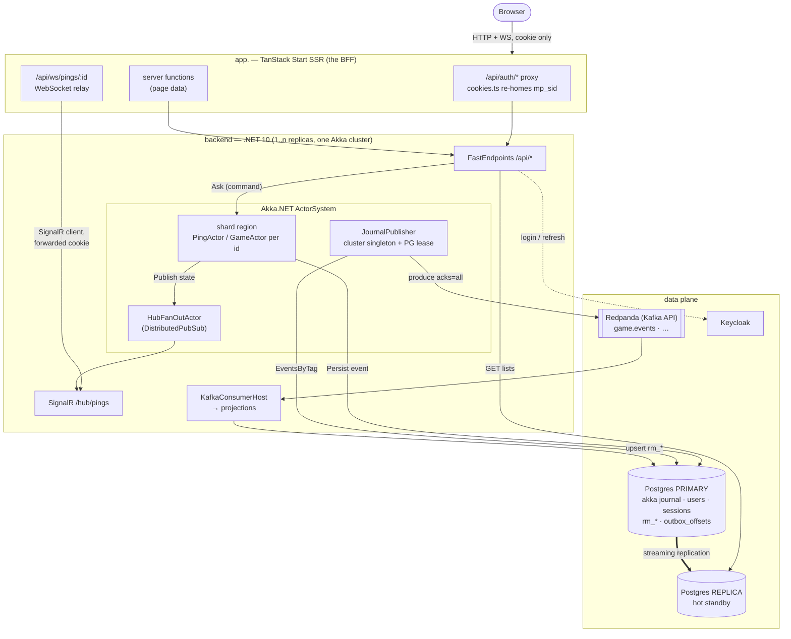
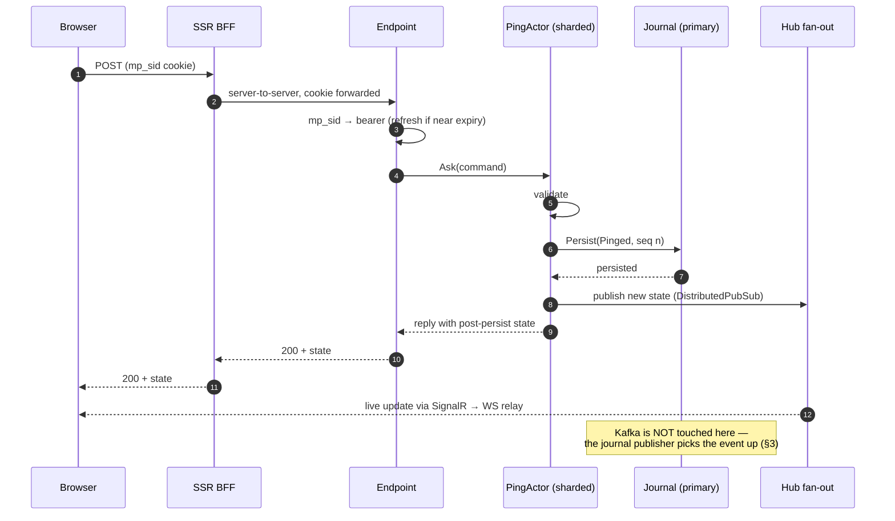
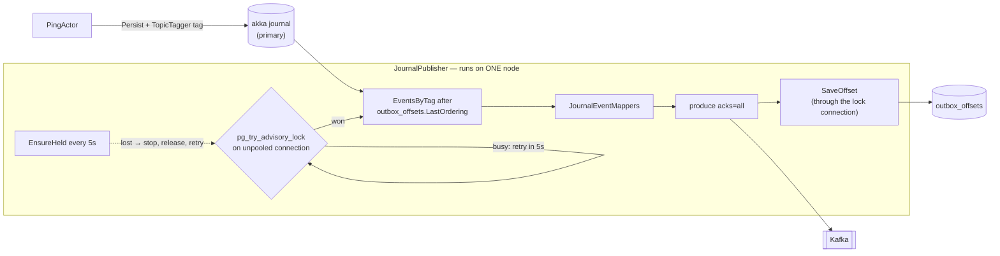
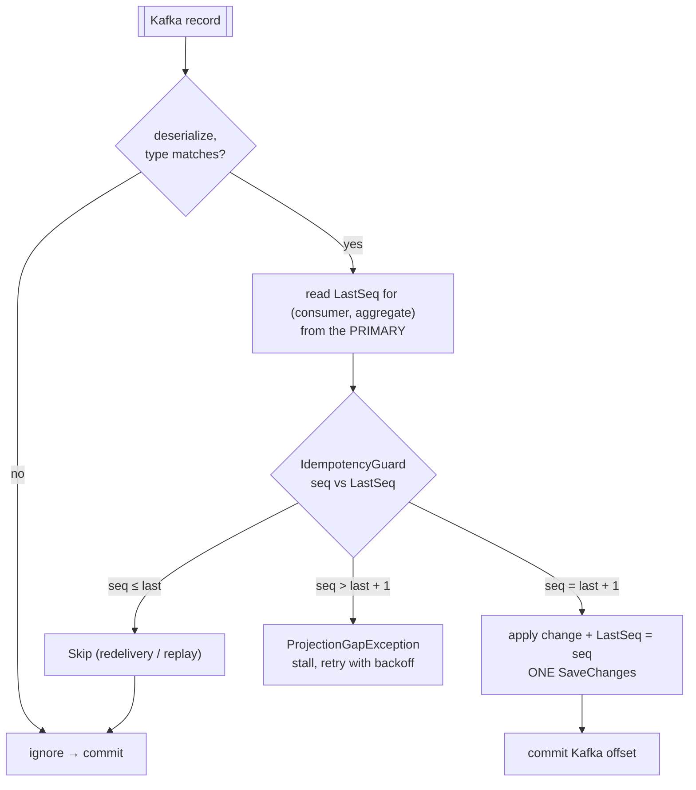
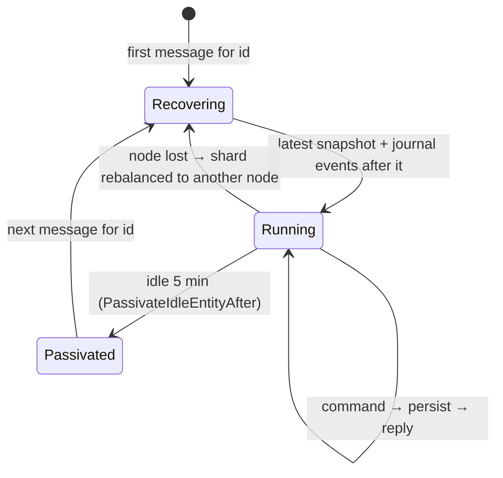
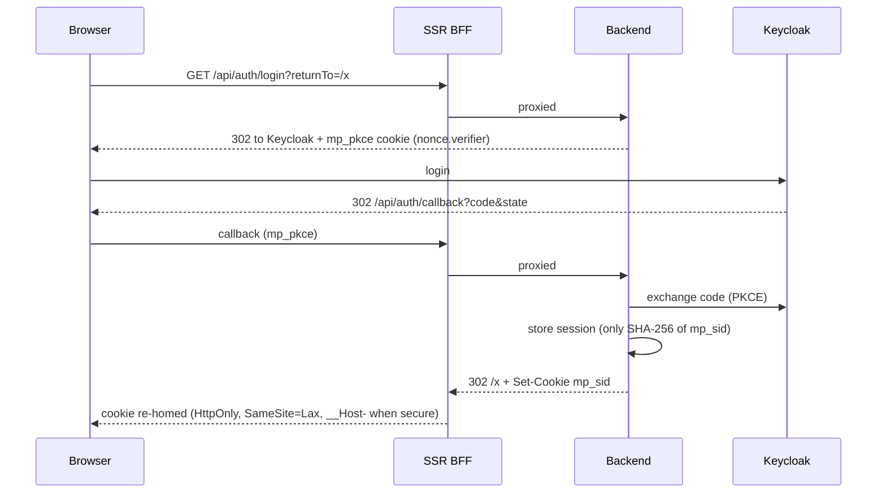

# Architecture

How a request moves through the system today, drawn from the code as of Part 0 (the `PingActor` spine).
Part 1 swaps `PingActor` for `GameActor`; every path below stays the same. [`ROADMAP.md`](../ROADMAP.md)
says _why_ each choice was made, [`CLAUDE.md`](../CLAUDE.md) says _where_ it lives — this file shows
_how the pieces move_.

Rules the diagrams obey:

1. **Postgres is the source of truth.** Actors and Kafka move state; the database wins any disagreement.
2. **Commands are answered by the actor**, from its post-persist state — you always read your own write.
3. **Queries read the replica** and are eventually consistent. Lists use keyset paging.
4. **Actors never produce to Kafka.** Kafka is derived from the journal and can never be ahead of it.
5. **The browser has one origin** (`app.`), for HTTP and WebSocket alike. The API is internal.

## 1. System overview

## 2. A command, end to end

`POST /api/pings/{id}` — the shape every Part 1 move will take.

The HTTP reply and the live update both come from the actor, so neither waits on replication or Kafka.

## 3. Journal → Kafka (the outbox)

Two layers decide who publishes:

- **Akka cluster singleton** decides _where_ — the oldest backend node, handed over on leave/down.
- **Postgres advisory lock** decides _whether_. In a split brain both halves may start a singleton; only
  one database session can hold the key (`"chess_ob"`), so only one publishes.

Why the lock is trustworthy:

| Mechanism                            | Effect                                                                                   |
| ------------------------------------ | ---------------------------------------------------------------------------------------- |
| Session-level lock                   | Released the moment the session ends — a crashed holder needn't cooperate.               |
| `Pooling = false`                    | "Close" really ends the session. A pooled close would keep the lock alive in the pool.   |
| Offsets saved on the lock connection | A holder that lost its session can't save progress; its next save fails and it stops.    |
| `LastOrdering < @o` on update        | The offset only moves forward.                                                           |
| `EnsureHeldAsync` every 5 s          | An idle holder notices a lost lock even with no saves to fail.                           |
| Server TCP keepalives (compose)      | A holder that vanishes without closing its socket loses the lock in ~30 s, not ~2 hours. |

Delivery is **at-least-once**: after a failure the next holder resumes from the saved offset and may
re-send the last unsaved batch. Consumers absorb that (§4).

## 4. Projections (Kafka → read models)

Projections are **read-modify-write on the primary**, not blind writes:

- The watermark is read from the **primary**. Reading it from the replica could see a stale `LastSeq` and
  double-apply.
- Two ways to hold the watermark: on the read row itself (`PingProjection` → `rm_pings.LastSeq`), or in
  `consumer_positions` for consumers with no per-aggregate row (`PositionedProjection<T>`), saved in the
  same `SaveChanges` as the staged change.
- The Kafka offset commits only after `ApplyAsync` returns, so a crash re-delivers and the guard skips.
- A gap stalls instead of skipping: a silently wrong read model is worse than a stuck one.

**Open:** read models carry no concurrency token. During a Kafka rebalance two consumers can briefly
apply the same `seq`; harmless for `rm_pings` (both write identical values), not for a projection that
inserts rows. Make the watermark a concurrency token before the first `PositionedProjection` lands.

## 5. Actors: how many, and for how long

One sharded entity per aggregate id — 10 000 live games means 10 000 `GameActor`s, which is cheap
(hundreds of bytes plus state each, zero CPU while idle). Only active aggregates stay in memory:

- `ShardCount = 50` shards spread over the backend nodes; adding a node moves shards to it.
- `PingActor` snapshots every 20 events, so recovery replays at most 19.
- Finished or historical games are never woken for reads — lists and history come from `rm_*` on the replica.

## 6. Reads and consistency

| Question                                        | Answered by              | Consistency                 |
| ----------------------------------------------- | ------------------------ | --------------------------- |
| "What happened after my command?"               | The command's reply      | Immediate (actor state)     |
| "What is this live aggregate right now?"        | `GET …/live`, SignalR    | Immediate (actor state)     |
| Lists, history, anything paged                  | `ReadDbContext` →replica | Eventual (~250–500 ms here) |
| Projection watermarks, sessions, users, offsets | `ProjectDbContext` →prim | Strong                      |

## 7. Auth in one picture

Tokens never leave the backend. Logout revokes the session row first, so the cookie is dead even if the
Keycloak call fails.
