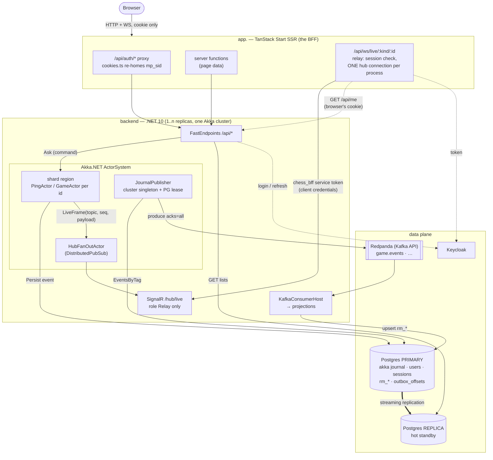
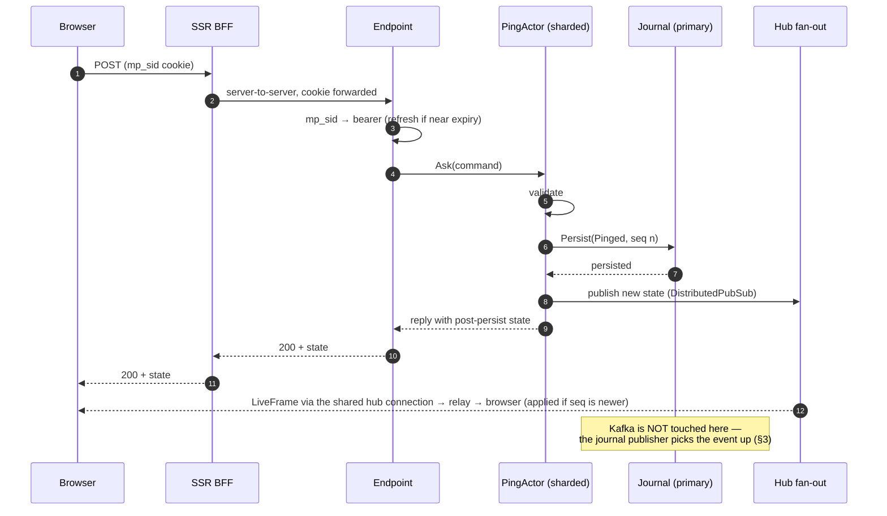
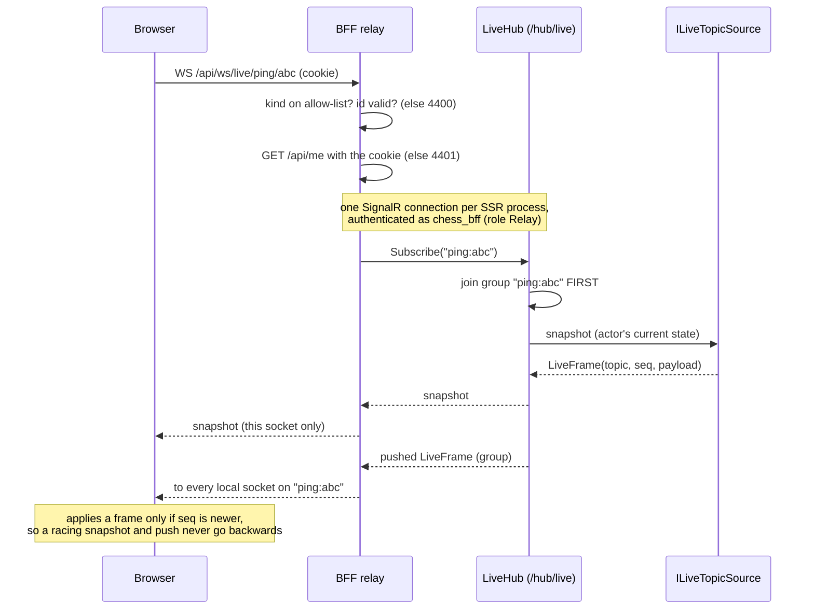
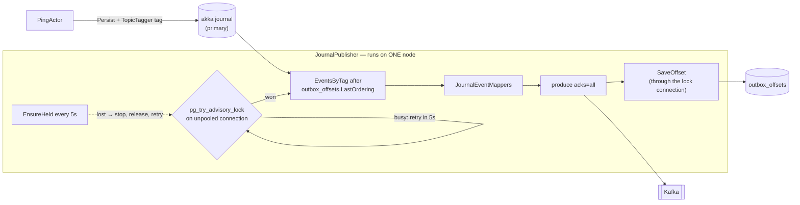
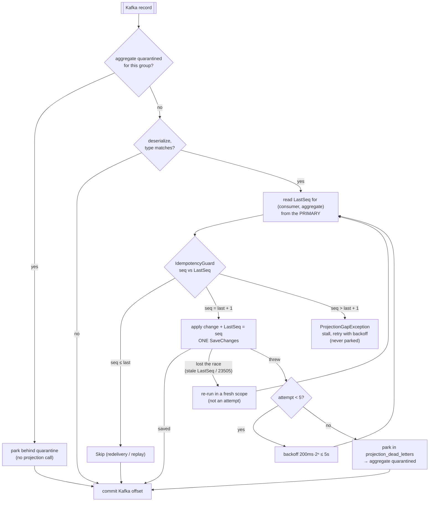
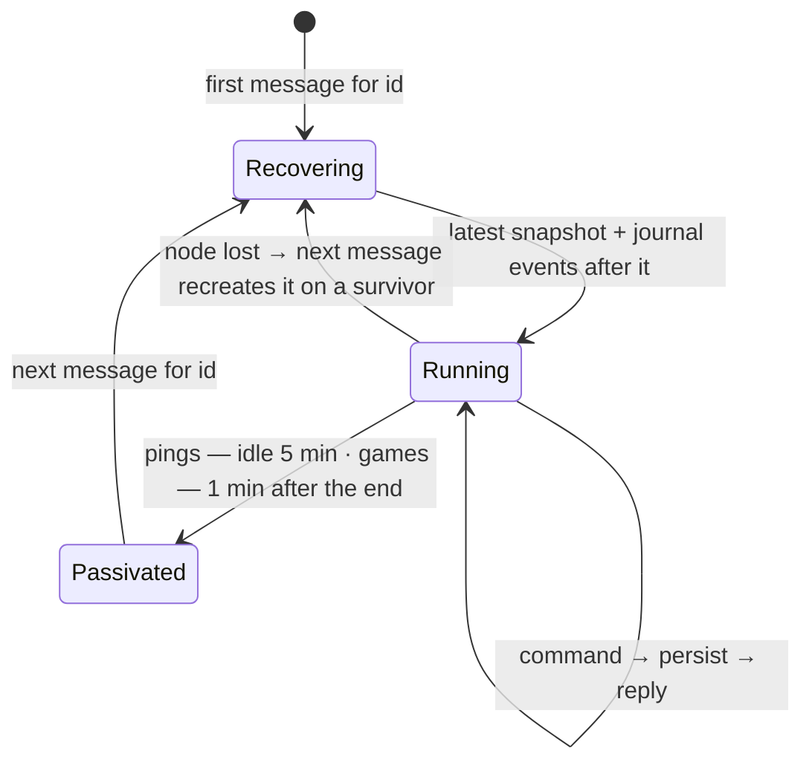
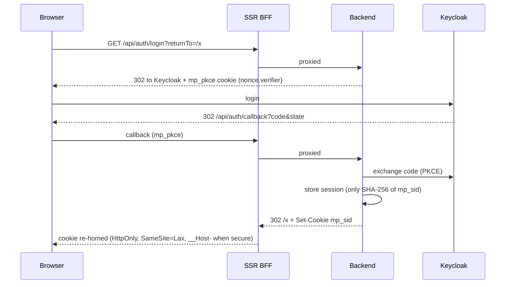

# Architecture

How a request moves through the system today, drawn from the code as of Part 0 (the `PingActor` spine).
Part 1 swaps `PingActor` for `GameActor`; every path below stays the same. [`ROADMAP.md`](../ROADMAP.md)
says _why_ each choice was made, [`CLAUDE.md`](../CLAUDE.md) says _where_ it lives — this file shows
_how the pieces move_.

Rules the diagrams obey:

1. **Postgres is the source of truth.** Actors and Kafka move state; the database wins any disagreement.
2. **Commands are answered by the actor**, from its post-persist state — you always read your own write.
3. **Queries read the replica** and are eventually consistent. Lists use keyset paging.
4. **Actors never produce to Kafka.** Kafka is derived from the journal and can never be ahead of it.
5. **The browser has one origin** (`app.`), for HTTP and WebSocket alike. The API is internal.

## 1. System overview

## 2. A command, end to end

`POST /api/pings/{id}` — the shape every Part 1 move will take.

The HTTP reply and the live update both come from the actor, so neither waits on replication or Kafka.

### Watching live state (ROADMAP D5)

- **Topics** are `{kind}:{id}`. A kind plugs in with one backend `ILiveTopicSource` and one entry on the BFF's
  allow-list. The hub, fan-out and relay never read payloads.
- **Sharing:** the first local subscriber to a topic joins the backend group and the last one leaves it. 5
  viewers on one ping cost the backend one connection (measured on the local stack).
- **Who may watch:** the hub admits only the `Relay` role. The BFF admits a browser only with a valid session
  and re-checks it every 5 minutes (close code 4401 when it ends).

## 3. Journal → Kafka (the outbox)

Two layers decide who publishes:

- **Akka cluster singleton** decides _where_ — the oldest backend node, handed over on leave/down.
- **Postgres advisory lock** decides _whether_. In a split brain both halves may start a singleton; only
  one database session can hold the key (`"chess_ob"`), so only one publishes.

Why the lock is trustworthy:

| Mechanism                            | Effect                                                                                   |
| ------------------------------------ | ---------------------------------------------------------------------------------------- |
| Session-level lock                   | Released the moment the session ends — a crashed holder needn't cooperate.               |
| `Pooling = false`                    | "Close" really ends the session. A pooled close would keep the lock alive in the pool.   |
| Offsets saved on the lock connection | A holder that lost its session can't save progress; its next save fails and it stops.    |
| `LastOrdering < @o` on update        | The offset only moves forward.                                                           |
| `EnsureHeldAsync` every 5 s          | An idle holder notices a lost lock even with no saves to fail.                           |
| Server TCP keepalives (compose)      | A holder that vanishes without closing its socket loses the lock in ~30 s, not ~2 hours. |

Delivery is **at-least-once**: after a failure the next holder resumes from the saved offset and may
re-send the last unsaved batch. Consumers absorb that (§4).

## 4. Projections (Kafka → read models)

Projections are **read-modify-write on the primary**, not blind writes:

- The watermark is read from the **primary**. Reading it from the replica could see a stale `LastSeq` and
  double-apply.
- **Games:** `GameProjection` (group `chess.rm-games`) keeps `rm_games` (one row per game, `LastSeq` as
  watermark and concurrency token), `rm_game_players` (one row per player, for "my games") and `rm_moves` (one row
  per move). Names are snapshotted at `game.created` (D23), and the PGN is built from the moves at `game.ended`
  (D22).
- Two ways to hold the watermark: on the read row itself (`PingProjection` → `rm_pings.LastSeq`), or in
  `consumer_positions` for consumers with no per-aggregate row (`PositionedProjection<T>`), saved in the
  same `SaveChanges` as the staged change.
- `LastSeq` is an EF **concurrency token**. A consumer that loses a rebalance race gets a conflict, and
  `ProjectionRunner` re-runs the record, which then skips.
- The Kafka offset commits only after `ProjectionRunner` returns, so a crash re-delivers and the guard skips.
- A gap stalls instead of skipping: a silently wrong read model is worse than a stuck one.
- **Dead letters:** one poison event blocks only its own aggregate in its own group. Parking and replay
  serialise on `pg_advisory_xact_lock` per `(group, aggregate)`. An admin lists parked records with
  `GET /api/admin/projections/dead-letters` and replays one aggregate in `seq` order with
  `POST /api/admin/projections/{groupId}/dead-letters/{aggregateId}/replay` (200 / 409 / 404). The
  health check `projection-dead-letters` turns `/health` Degraded while anything is quarantined.

## 5. Actors: how many, and for how long

One sharded entity per aggregate id. 10,000 live games means 10,000 `GameActor`s, which is cheap: hundreds of
bytes plus state each, and zero CPU while idle. When an entity leaves memory depends on its type:

- `ShardCount = 50` shards are spread over the backend nodes; adding a node moves shards to it.
- **Pings:** region idle passivation of 5 minutes, a snapshot every 20 events.
- **Games:** the `games` region has idle passivation **off**. Akka's 120 s default would stop a classical game
  during a long think, and the entity's clock timers with it. Each game passivates itself according to its
  `PassivationPolicy`: live controls never while playing, and 1 minute after the end. Snapshots (every 20
  events) store the **UCI move list**, because threefold repetition needs history, not just a FEN (D22).
- A live game whose node dies stays dormant until any message (a move, a `/live` read, a live-socket subscribe)
  recreates it. Recovery gives the side to move its clock back as of the last event (D14) and re-arms the
  timers. Change 4's heartbeat makes that wake-up prompt.
- Once change 2 lands, finished games are read from `rm_*` on the replica and never woken.

### A game's life (`Akka/Games/GameActor`)

```mermaid
stateDiagram-v2
    [*] --> Created: IGameStarter → CreateGame (GameCreated)
    Created --> Playing: White's first move (no clock yet)
    Created --> Ended: no first move in 1 min / abort → *, aborted
    Playing --> Playing: MoveMade (clocks run from Black's first reply; −elapsed +increment)
    Playing --> Ended: checkmate · stalemate · insufficient material · threefold · 50-move
    Playing --> Ended: resign · draw agreed · flag fall (timer, no message needed)
    Ended --> [*]: passivate after 1 min
```

The rules go only through `Games/ChessRules` (Gera.Chess behind an alias). Every event
(`GameCreated`, `MoveMade`, `DrawOffered`, `DrawDeclined`, `GameEnded`) goes to `game.events` keyed
`game:{id}`, and to the live relay as a `game:{id}` frame.

## 6. Reads and consistency

| Question                                        | Answered by              | Consistency                 |
| ----------------------------------------------- | ------------------------ | --------------------------- |
| "What happened after my command?"               | The command's reply      | Immediate (actor state)     |
| "What is this live aggregate right now?"        | `GET …/live`, SignalR    | Immediate (actor state)     |
| Lists, history, anything paged                  | `ReadDbContext` →replica | Eventual (~250–500 ms here) |
| Game lists, my games, summary, moves, PGN       | `ReadDbContext` →replica | Eventual                    |
| A finished game's live snapshot                 | `rm_games` →replica      | Eventual; actor if not yet  |
| Projection watermarks, sessions, users, offsets | `ProjectDbContext` →prim | Strong                      |

## 7. Auth in one picture

Tokens never leave the backend. Logout revokes the session row first, so the cookie is dead even if the
Keycloak call fails.

**Which tokens the API accepts:** the issuer must be the realm, and the audience must include `chess_api`,
enforced in every deployed environment. Two clients carry that audience:

- `chess_api`, the user login above;
- `chess_bff`, the relay's service account, whose only role is `Relay` and which is the only identity the live
  hub admits.

A realm token issued to any other client (e.g. `admin-cli`) gets 401.
